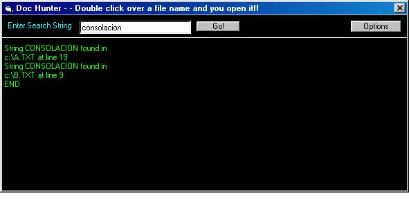



## KIKE Doc v1\.2

### Description

This program search a string in multiple documents at

the same time and lets you open the match documents from

the program.

I`ve had add some new features like select the extension

of documentes, view only the 10 first matches and save the

configuration to use in another sesion.

I`ve fixed the program for this usefull version.

Thank yours for this chance.
 
### More Info
 
To set the path of the documents go to the options

form where you find more things

             |
---                |---
**Submitted On**   |2001-01-05 09:18:50
**By**             |[Enrique Robledo Montes](https://github.com/Planet-Source-Code/PSCIndex/blob/master/ByAuthor/enrique-robledo-montes.md)
**Level**          |Advanced
**User Rating**    |4.7 (14 globes from 3 users)
**Compatibility**  |VB 5\.0, VB 6\.0
**Category**       |[String Manipulation](https://github.com/Planet-Source-Code/PSCIndex/blob/master/ByCategory/string-manipulation__1-5.md)
**World**          |[Visual Basic](https://github.com/Planet-Source-Code/PSCIndex/blob/master/ByWorld/visual-basic.md)
**Archive File**   |[CODE\_UPLOAD13399152001\.zip](https://github.com/Planet-Source-Code/enrique-robledo-montes-kike-doc-v1-2__1-14068/archive/master.zip)

